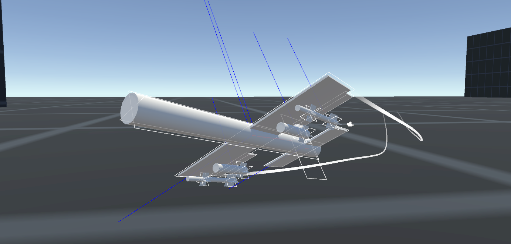
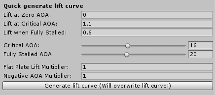

# SimpleWings

A simple, configurable aerodynamic wing that applies lift and drag forces based on pre-defined curves. Includes a flyable example airplane, along with a bomb and rocket. Built in Unity 5.6.4.

## Download

You can either clone the repository, or [download either the demo or asset package from the releases page](https://github.com/brihernandez/SimpleWings/releases).

## Demo Controls

The demo plane is best flown with an Xbox One controller. Keyboard controls will work, but because of the on/off input that comes from keys, it's not the best experience.

### Gamepad

- Left stick: Pitch and Roll
- Triggers: Yaw
- A: Speed up
- B: Slow down
- X: Fire weapons

### Keyboard

- W/S/Up/Down: Pitch
- A/D/Left/Right: Roll
- Q/E: Yaw
- L Shift: Fire weapons
- R: Speed up
- Spacebar: Slow down

# Wings

These wings are driven through a very abstract approximation of aerodynamics. Lift and drag coefficients are simulated through pre-defined curves created on a WingCurve ScriptableObject. As the angle of attack changes, so does the lift and drag forces incurred. Lift is always perpendicular to the air flow, while drag is always in the opposite direction of the velocity.

By putting together wings onto an object in a reasonable way, it's easy to create a physics based flyable airplane. To turn the plane (without cheating with Rigidbody.AddTorque), you will need to deflect wings to create a torque on the plane. Included is a very basic control surface component to facilitate this. See the example Airplane prefab for how to set this up.

## SimpleWing Component

Both a WingCurve and Rigidbody are **requred**. The Rigidbody preferably should be on a parent gameobject that represents the object using the wings. The Rigidbody can be assigned manually through script, but it also automatically uses "GetComponentInParent" during its Awake to try and find one.

- Dimensions: The dimensions of the wing. The bigger the wing, more the lift (and drag) it applies. A white outline is displayed of the dimensions of the wing.

- Apply Forces at Center: When true, the wing will apply lift and drag at the center of mass. For certain wings, such as something that might be representing the inherent lift of a fuselage, it may be desirable for all wing forces to not impart a torque on the rigidbody.

- Wing: The wing curve. Required for the wing to function. See Wing Curve section below for more details.

- Lift/Drag multiplier: The wings are currently scaled to work with realistic weights and sizes. In these cases, values close to 1 are "realistic", but these values allow tweaks as necessary.

## Wing Curves

Wing Curves can be created by right clicking in the Project window and selecting Create -> Wing Curve. They are required for wing operation, and represent the "flight model." These can be arbitrarily tweaked, but two example curves have been given that should be useful for most cases.

The Standard Wing is based on [experimental data on the NACA 0015 airfoil](http://www.aerospaceweb.org/question/airfoils/q0150b.shtml). It's a symmetrical wing, so it doesn't generate lift at zero angle of attack. However, because it's still a wing, it is very responsive to angle of attack and creates lift easily with minimal angles of attack. It will however stall at around 16 degrees and lift will drop dramatically. This wing is designed to be used by the main wing(s) on a plane.

The flat plate wing is what it sounds like and is a good approximation for control surfaces or fins on a missile. They produce lift, but that's only because they have an angle of attack and the wind beneath it is pushing it upwards. These don't really stall, but they don't really produce much lift unless they're deflecting pretty hard.

The Lifting wing is a high lift wing that generates lift even at 0 degrees angle of attack, but stalls easily. It's based loosely on the [NACA 2408 wing](http://airfoiltools.com/airfoil/details?airfoil=naca2408-il#polars).

# Creating Wings

[screenshot](Screenshots/wingcurve.png)

When creating wings, the most important points are the first and last 3. These are the ones that most often are directly available in any kind of lift coefficient vs alpha graph, and the ones will most often be adjusting. Most of CL graphs will stop a little after the stalling point, at which point air flow becomes unpredictable, but eventually starts following the pattern of a generic flat plate. This is represented by the middle 3 points in the default graph and for the most part will not need to be adjusted.

To aid in creating wings, a lift curve generator is available. With it, you can specify the basic parameters of the curve such as where the critical angle of attack is, and how much lift the wing generates at this point. Tooltips are available on each option.

## Control Surface

To actually fly the plane, you'll need to deflect your wings. The ControlSurface class is included as a simple example, but really shouldn't be taken as gospel. It's a bit hacky.

It's very simple to operate. All you need to do is set a normalized deflection (-1 to 1) through script using the Deflection property. From there, the control surface will move to the specified deflection at their given speed. Control surfaces only deflect in the "pitch" axis, so make sure you orient these as needed.

For certain control surfaces you can put the wings on the same game object, but often times you want the axis of rotation to be different from where the wing is physically located. In those cases, the wing is best on a child game object. See the Airplane prefab for examples on how to set these up with wings.
